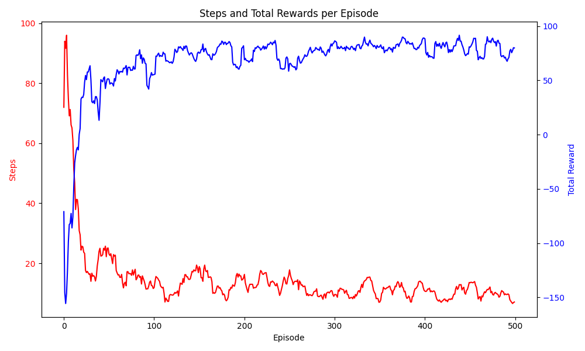
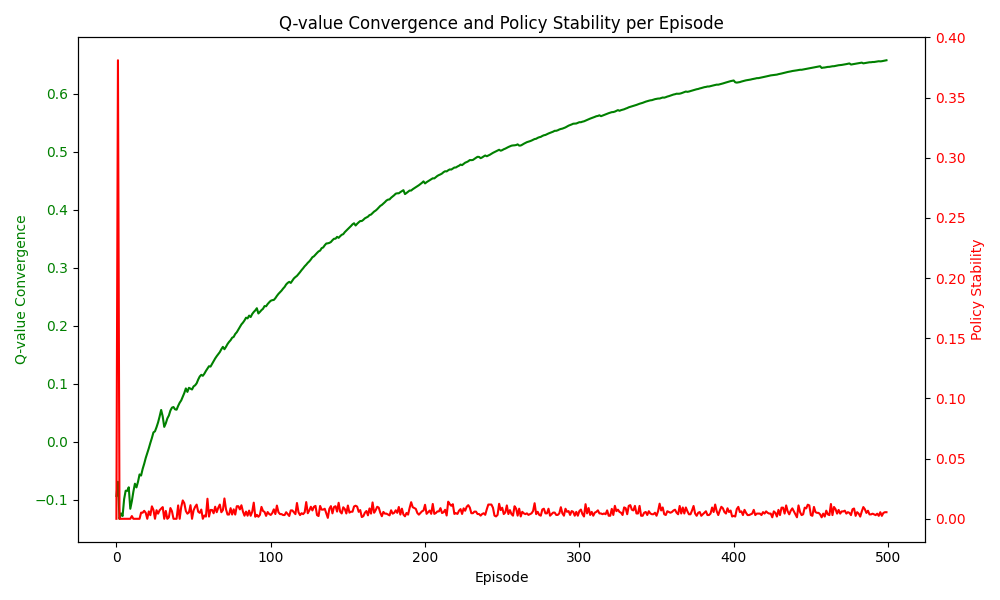
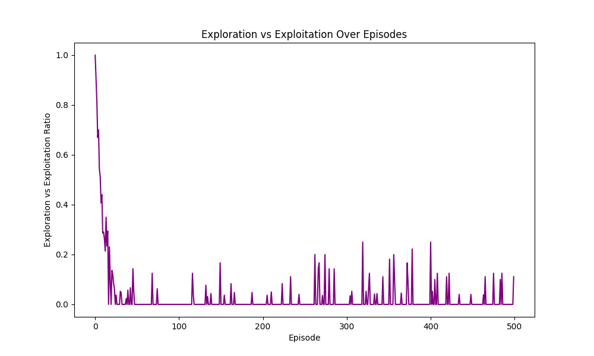
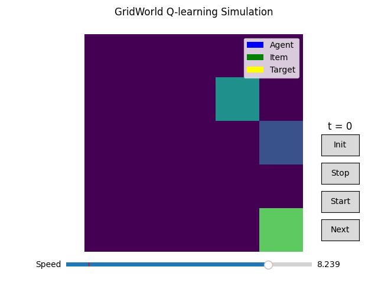

# GridWorld

This repository contains code and experiments for a reinforcement learning project in a grid world environment.  
The project is structured in three stages:

---

## Project Stages

* [Stage 1: Table-based Q-Learning Agent](#stage-1-table-based-q-learning-agent)
* [Stage 2: Deep Q-Learning (DQN)](#stage-2-deep-q-learning-dqn)
* [Stage 3: Multi-Agent DQN (MARL)](#stage-3-multi-agent-dqn-marl)

---

## Stage 1: Table-based Q-Learning Agent

This project implements a tabular Q-learning agent to solve a transport task in a grid world environment.  
The agent learns to pick up an item located at a random position (A) and deliver it to a fixed location (B) while minimizing the number of steps taken.

---

## 1. Environment Setup

- **Grid Size**: Default 5×5 (configurable)
- **Agent Start Position**: Randomized each episode
- **Item Location (A)**: Randomized per episode
- **Goal Location (B)**: Fixed at bottom-right corner (n, n)
- **State Space**: Agent position, item position, item possession
- **Action Space**: Move north, south, east, or west

---

## 2. Reward Design

- `-1`: Penalty per step (encourages shortest path)
- `+5 / -5`: Getting closer/farther from the item
- `+10 / -10`: Getting closer/farther from the goal while carrying the item
- `+50`: Successful delivery
- `-50`: Reaching the goal without the item

---

## 3. Q-Learning Summary

- **Q-table**: Initialized with zeros
- **Policy**: ε-greedy for exploration-exploitation balance
- **Learning Rate Decay (α)**: Gradually decreases over episodes
- **Exploration Rate Decay (ε)**: Decays toward a minimum threshold
- **Bellman Update Rule**:
  $$
  Q(S_t, A_t) \leftarrow Q(S_t, A_t) + \alpha [R_{t+1} + \gamma \max_{a'} Q(S_{t+1}, a') - Q(S_t, A_t)]
  $$

---

## 4. Training Procedure

- The agent is trained over 500 episodes.
- At each episode, the agent starts randomly and learns by updating Q-values step-by-step.
- Performance metrics include step count, total reward, Q-value change, and policy stability.

---

## 5. Visualizations

### 1. Steps and Total Rewards per Episode

The number of steps gradually decreases and rewards increase as the agent learns a more optimal policy.

---

### 2. Q-value Convergence and Policy Stability

Q-values stabilize and the agent consistently selects optimal actions.

---

### 3. Learning Curve Stability (Reward Variance)

Early high variance indicates exploration, which stabilizes over time.

---

### 4. Exploration vs. Exploitation

Exploration is high in early episodes and gradually gives way to exploitation.

---

### 5. GridWorld Simulation Snapshot

Agent (blue), item (green), and goal (yellow) shown at simulation start.

---

## 6. Conclusion

This project demonstrates the effectiveness of tabular Q-learning in solving a structured transport task in a discrete grid environment.

- **Improved efficiency**: The number of steps decreased over episodes while total reward increased.
- **Q-value convergence**: Q-values stabilized over time with learning rate decay.
- **Stable policy**: Actions became more consistent, indicating reliable learning.
- **Balanced exploration**: The decaying ε strategy allowed for early exploration and later exploitation.
- **Learning stability**: Reward variance decreased, showing more stable performance.

Q-learning, combined with effective reward shaping and decay strategies, enabled the agent to learn an efficient policy with no prior knowledge of the environment.

---

# Stage 2: Deep Q-Learning (DQN) with a Single Agent

This stage builds upon Stage 1 by replacing tabular Q-learning with a Deep Q-Network (DQN). The goal is to enable the agent to generalize over a larger, high-dimensional state space using a neural network. The environment is also made more dynamic, with the goal location changing randomly every episode.

---

## 1. Key Differences from Stage 1

- **Goal Location (B)** is no longer fixed—it is randomly generated in each episode.
- **State Space** includes agent position, item location, and goal location, increasing input dimensionality.
- **Q-value estimation** is performed by a neural network instead of a lookup table.
- **Experience Replay** and **Target Network** are introduced to stabilize learning.

---

## 2. DQN Architecture and Training Flow

- The agent uses a deep neural network (DNN) to estimate Q-values for each action given the current state.
- The predicted Q-values are compared with TD target values using MSE loss, and updated via backpropagation.
- Past experiences are stored in an experience replay buffer and sampled randomly to break temporal correlations.
- A separate **target network** is periodically updated to provide stable Q-targets.

---

## 3. Observations and Experimental Results

### Observation 1: Limitation of Manhattan Distance for Evaluation

- In Stage 1, we used the average Manhattan distance (Figure 1, red line) to represent the default shortest path.
- However, since the map’s coordinates (start, pickup, goal) are randomly generated in each episode, the average alone cannot represent the optimal path in all cases.
- Therefore, **we calculated the Manhattan distance for each individual map** as the ground truth to verify whether the learned policy reaches the optimal standard.

---

### Observation 2: Evaluation After 10,000 Episodes of Training

- After training the DQN agent for 10,000 episodes, we tested it on **100 randomly generated maps**.
- The procedure for generating start, pickup, and goal points during testing matched that of training.
- **The agent’s actual performance exactly matched the calculated optimal steps and rewards**, indicating highly successful learning.

---

## 4. Conclusion

After 10,000 training episodes, the DQN agent showed excellent generalization and path planning capability.  
Specifically:

- The learned policy consistently matched the optimal path in terms of both reward and step count.
- The dynamic state representation and use of DQN enabled the agent to learn in environments with greater variability.
- Experience replay and target network mechanisms helped stabilize training and improved convergence.

This demonstrates that **DQN can overcome the limitations of tabular Q-learning** in more complex environments, and can be effectively used to train agents to learn optimal behavior across diverse scenarios.

# FIT5226 Project Stage 3: Multi-Agent DQN Learning

---

## 1. Introduction

Stage 3 extends the single-agent DQN system from Stage 2 into a **multi-agent environment**.  
There are four agents, divided into **two types** (Type 1 and Type 2, with two agents per type).  
Each agent starts with **only half of a secret**, and **must meet with an agent of the opposite type** to exchange secrets. Only after doing so can they reach the target location to complete the task.

- The grid size is 5×5.
- All agent positions and the target are randomly initialized each episode with no overlaps.
- An episode ends when **any agent with the full secret reaches the target**.

---

## 2. Implementation Components

- `DQN` class  
- `Environment` class  
- `Agent` class  
- `SharedReplayBuffer` class  
- `Trainer` class  
- **Animation system**: `AnimeAgent`, `MoveHistory`, `create_agent_movement_animation()`  
- `Tester` class  

**Purchased options:**
1. **Option 4**: Closest agent of opposite type (location)
2. **Option 5**: Central clock (ordered agent update)

---

## 3. Environment Setup

- **Grid size**: 5×5  
- **Initial positions**: Randomized per episode for both agents and the target (no overlaps)  
- **Central clock mechanism:**
  - Before secret exchange: The shortest-path agent from each type takes turns
  - After secret exchange: The agent with the shortest distance (regardless of type) moves next

---

## 4. Agent Setup

- **Agents 0 & 1**: Type 1 → share `dqn1` and `replaybuffer1`  
- **Agents 2 & 3**: Type 2 → share `dqn2` and `replaybuffer2`  
- **Action space**: `['n', 's', 'e', 'w', 'wait']`

---

## 5. Training Configuration

- **State vector size** = `n * n * 3 + 1` = **76** (for 5×5 grid)
  - 25: agent position (one-hot)
  - 25: target position (one-hot)
  - 25: closest opposite-type agent position (one-hot)
  - 1: whether the agent possesses the full secret

- Each agent type trains its DQN every 3 steps
- The target network is synced every 500 steps

---

## 6. Reward Structure

To ensure stable learning, all reward values are scaled between **-1 and +1**.  
The Q-values typically range in small decimal magnitudes.

| Condition | Reward |
|----------|--------|
| Reaches the target with full secret | +1.0 |
| Successful secret exchange | +0.5 |
| General penalty (each step including `wait`) | -1.0 |

---

## 7. Learning Results

### ✅ Training Curves

- **Reward increases** over episodes → indicating improved policies
- **Loss decreases**, showing model convergence
- **Step count** gradually decreases → agents require fewer moves to complete the task

---

### ✅ Performance Summary

- **Training (Episodes 1 to 50,000)**  
  - Success rate: **91.37%**  
  - Optimal path difference: **9.0996**  
  - Current score: **2**

- **Testing (Episodes 1 to 1,000)**  
  - Success rate: **52.60%**  
  - Optimal path difference: **14.5236**  
  - Current score: **0**

- **Costs (C)**: Purchased 2 options → `C = 2 + 1 = 3`  
- **Score (B / B')**:  
  - `B = 2` (training)  
  - `B' = 0` (testing)  
- **Alpha coefficient**:  
  - `α = 0.835` (training), `α' = 0.505` (testing)

---

## 8. Conclusion

- After 20,000+ episodes of training, agents have learned to **cooperate by exchanging secrets** and successfully completing the transport task.
- The **reward and loss curves** show steady convergence, indicating that both policy learning and value estimation are progressing effectively.
- The use of **shared DQNs**, a **central clock**, and **observation of opposite-type positions** has significantly improved the learning dynamics.
- The noticeable drop in testing performance highlights the **gap in generalization**, which can be addressed in future work by further refining reward design, exploration strategy, or curriculum-based learning.

> Stage 3 showcases not only path optimization, but also **emergent cooperation, secret-based coordination, and decision-making under partial observability in multi-agent reinforcement learning.**

