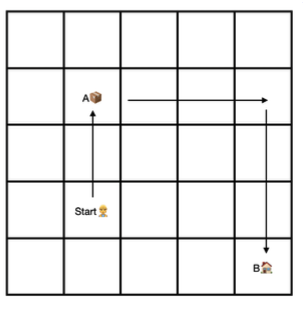
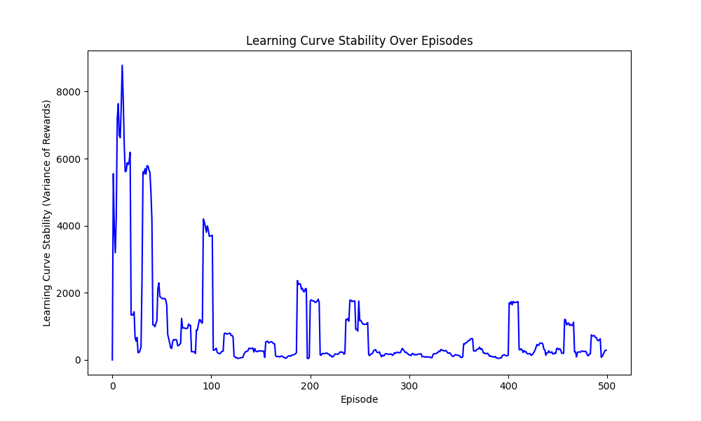

# GridWorld

This repository contains code and experiments for a reinforcement learning project in a grid world environment. The project is structured in three stages:

## Project Stages

- **Stage 1**: Table-based Reinforcement Learning with a single agent
- **Stage 2**: Deep Q-Learning (DQN) with a single agent
- **Stage 3**: Multi-Agent Reinforcement Learning (MARL)

---

## Stage 1: Table-Based RL (Single Agent)

In Stage 1, a single agent is trained to perform a pickup-and-delivery task in a square grid world of size *n × n* using table-based Q-learning.

### Task Description

- The agent starts at a random position in the grid.
- An item is located at position **A** (randomized each episode).
- The delivery target **B** is fixed at the bottom-right corner: *(n, n)*.
- The agent automatically:
  - Picks up the item upon reaching A
  - Drops the item at B, completing the task

### Agent Observations

- The agent's own position
- The position of A
- Whether it is carrying the item

### Agent Actions

- Move north
- Move south
- Move west
- Move east

### Objective

The goal is for the agent to learn a policy that minimizes the number of steps required to complete the task using tabular Q-learning.

### Environment Illustration



### Sample Result

Learning performance over training episodes:



---

## Stage 2: Deep RL (Single Agent)

*To be added.*

---

## Stage 3: Multi-Agent RL (MARL)

*To be added.*

---

## Getting Started

Install dependencies and run notebooks:

```bash
uv venv .venv
source .venv/bin/activate
uv pip install -r requirements.txt
jupyter notebook stage1.ipynb
